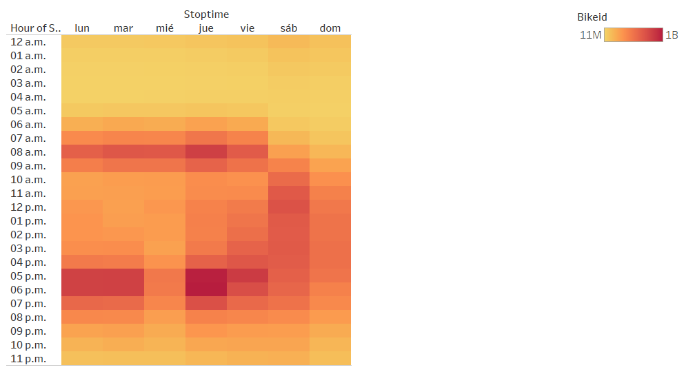

# NYC Citibike Analysis

To watch the complete Story in Tableau click here: https://public.tableau.com/app/profile/luis.fernando.carmona.zaack/viz/NYCCityBikeAnalysisChallenge_16488566036610

## Overview

The purpose of this analysis is to convince investors that a bike-sharing program in Des Moines will be a solid business. So, I created a story to solidify the proposal, because one of the key stakeholders would like to see a bike trip analysis.
For this analysis, I used Pandas to change the "tripduration" column from an integer to a datetime datatype. Then, I used the converted datatype to create a set of visualizations to show:

`(a)` The length of time that bikes are checked out for all riders and genders; 

`(b)` The number of bike trips for all riders and genders for each hour of each day of the week; and

`(c)` The number of bike trips for each type of user and gender for each day of the week.

## Results

After the application of the steps above mentioned, the results are the following:

`(i)` The bubbles on the map show the stations where the riders start the trips.

`(ii)` This heatmap shows the number of bike trips by weekday for each hour of the day.

`(iii)` The graph shows the length of time that bikes are checked out for all riders.

`(iv)` This graph represents the length of time that bikes are checked out for each gender.

`(v)` The graph shows the number of bike trips by gender for each hour of each day of the week as a heatmap.

`(vi)` This heatmap shows the number of bike trips broken down by gender for each day of the week by each Usertype.

`(vii)` The bubbles on the map represent the stations that receive more of the bikes at the end of each ride.

## Summary

**1.** According to Top Starting and Top Ending Locations Map, the stations with more traffic are almost the same in both maps and are in places near business centers and apartments without parking, so the stations in Des Moines could be installed in similar places. 

**2.** The males use more bike-sharing apps than the females.

**3.** The hours with more traffic are the work entry and the work exist.

Finally, as is represented in the  images, the most frequently aged users are those who were born in 1970 in the case of females and in 1990 in the case of males.

